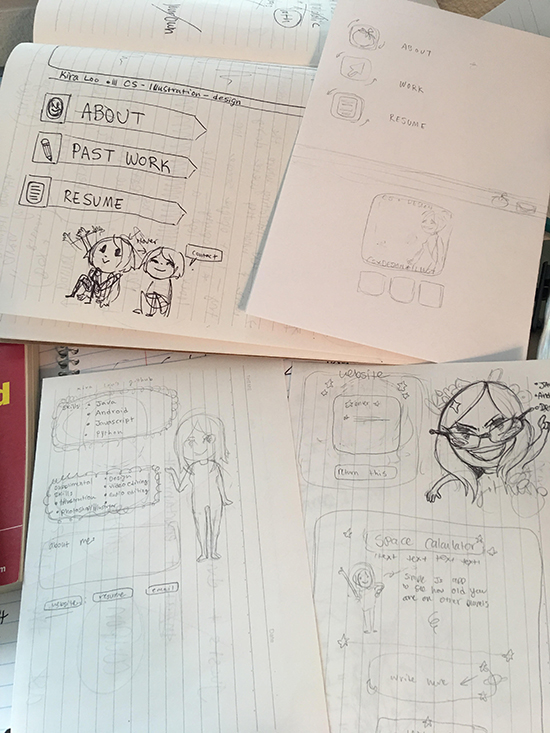
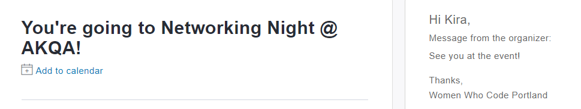
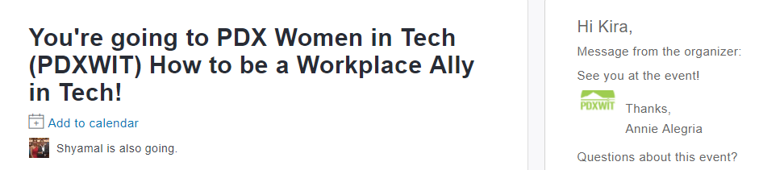

### Kira's Friday, September 29, 2017
### By Kira Loo
━━━━━━━━━━━━━━━━━

_For this Friday project I thought it would be the best use of my time to spread my efforts out a bit. Usually on Fridays and in class my attention is generally focused on one subject. While focus is good for a single structured topic I think I can use this time to gather resources and better structure my limited time in the weeks remaining. I also find that writing out a list of goals and things I need to accomplish help me personally organize my thoughts.

I feel that some of my weaknesses are;_

	* -verbally talking about my code.
	* -memorizing syntax.
	* -code/web design.
	* -cohesiveness of my person brand.

 	_While I feel like I understand what my code is doing, often when I seek out help or try to explain to others what is exactly I’m doing, I truly don’t get my message across. In practicing with the group on white board questions this became further clear to me. I was having a hard time articulating what it was I was doing, something I feel was important to convey. The consequence of this was that I was also over-complicating ideas in my head, making things I knew easily how to solve unsolvable.

 	I can see a solution to this by finding resources of others speaking about code in-depth. Then emulating what they’re doing and better myself from it. I can start with simple problems then move on from there once I’m able to explain those things accurately and verbally clear. To accomplish this I called up one of my programming connections from High school. Back in the day we were close friends so I know I can trust him with responses about my abilities. Currently he is a software developer at Amazon (and always been an overachiever), so I know that the information he will be providing me will be useful._

  <https://www.linkedin.com/in/brennanhking/>
 	_Today I called him and have asked him to have little private sessions with me in regards to code lingo. We plan to completely break down and describe my builds, then he will quiz me on common questions and to elaborate on my code further (how can I scale this up?, how can I improve function x?, etc.) We plan to meet via phone call/skype/google hangouts at least every week dependent on his schedule. Should this not be possible to arrange due to both of our volatile schedules he will be sending me prompts via messengers that I can reply to._

	_My next weakness I also feel was laid out to me blatantly with the white boarding practice. I can break down what I need to do with the correct process, but even when it came to reciting a simple ‘for loop’ from memory, I messed up. This is rather unacceptable for me. I need to work on memorizing syntax and being able to fully recite basic concepts that I have memorized conceptually in my head onto paper/text editor without reference.  While on my phone call I also relayed this to Brennan. This problem is obviously something that goes hand in hand with the previous problem, so we will be working on it together as well, but it’s also something that I can work on more clearly on my own. He recommended me some books I could read to study up on the subjects, and today I went out and bought them._

  

  _This purchase doubles as interview prep and a quick break from the monotony at staring at my screen for hours on end.
 	Next I went through the book a little and read for a good hour. There were quite a few good points that I took note of but I also found examples of simple methods. From this point I thought it would be a good idea to practice some of these simple ones on paper. I know that when I’m working on a text editor I often will go over my previous projects or Epicodus lessons to rehash some of the concepts I’ve gotten a little hazy on. I think because of this I haven’t been able to memorize these methods as well as I could have. I read through many of the methods presented to me in the book and began breaking them down in my notes to understand them, next when I identified methods I’m bad at reciting I would copy them, with notes alongside. I was also, for the purpose of memorization, rewriting the parts of the function that I knew I needed to memorize better._

  

	_I plan over the weekend and the next coming couple of weeks to fully read (and re-read) through this book to make sure I have these concepts down.

 	As for design, I feel that overall I know how to design, but when it comes to applying it to a webpage and user-usability I have a lot to learn. This is a subject (the frontend) I feel like I am rather good at, I just need to be better, I very much want to be better at this. After Epicodus I of course want a job, and in the future I think I would like that path to lead more towards UX/UI. What I would like is to better improve the skills I have and make sure the pieces I’m putting out are extra, sparkling polished. I need to revamp some of my Github repositories to reflect this and really flesh out some of the work I’ve done. I want some of the pieces I’ve made to stand out and look good. I plan to rework (potentially from scratch) a couple of the projects I’ve worked on. Right now I want to focus on the end of Java unit group project. Seeing as we were a person short the project has much to be desired. I think I can completely rebuild it to my liking and creating something I’d be happy to talk about, as well as design it out how I personally see fit.

 	To improve my skills I plan to keep working out some projects & ideas from the ground up. My focus with these revisions is to completely make sure each one has a unique interface and is attractive. By unique interface I don’t necessarily mean completely different from other’s existing work, but that they are unique amidst my personal portfolio, displaying a range of work.
 	Next, almost supplementary to these other subjects today (as it hasn’t received as much attention yet) is cohesiveness of my personal brand. To my liking I like to present all the bits I’m working on with a similar aesthetic, meaning you can tell all the things presented by me are from me. I want my linkedin to match my resume to match my website to match my github. I’ve drawn out a little plan for this via sketches about how I’m going to work this into fruition._
 
 _These are all step-by-step changes that I can work on and implement throughout our remaining stay in my free time, that is aside from my personal page. Rather than relying on a CMS for my page I would like to build it from the ground up myself. However this requires a bit of a time commitment. The only time I can really allot to this is in my spare time, which I will be doing, but I have started the barebones of this site._

 <http://www.kizxm.com>

  _Something I’ve learned quite a bit about specifically today is DNS and web hosting. I purchased this domain a few days ago through Google Domains, and am quickly learning that was the wrong thing to do. Currently the website is in progress and only externally forwards to my published github page. This is not a long-term solution and is rather embarrassing of a mistake on my behalf. What I needed to do initially was create my site on a managed DNS site (I will be switching to NS1) not a domain registration site that forces 3rd party configuration sites with prebuilt pages. This is most definitely not what I want and has been extremely frustrating to deal with. Google Domains does not have a very friendly user interface, and as a newbie to webhosting I’m not entirely sure how to get the website domain I purchased off of google onto the managed DNS site of NS1. A lot of what is going on is going over my head and I have to put more time into solving this problem.

  	In second part to my overall appearance I scheduled a little photo-shoot with one of my previous classmates from college (a photographer) to take some professional pictures of me for my linkedin. While I could perfectly get by with a smartly taken phone selfie I want to go a little further and make sure everything looks exactly as I want. Check out my linkedin later this weekend to see how those turned out!
On a side note I also want to update my resume (again) !! This is a note so I don’t forget!!

 	Finally, for extended learning, I signed up for, first, the required meetup, and second, another meetup that sounded interesting to me. It’s just a simple networking night, but it was in the AKQA building, which is  (I think) going to be one of our internship places. This company actually interests me a lot so I want to go check it out and potentially make some cool new acquaintances._
  

